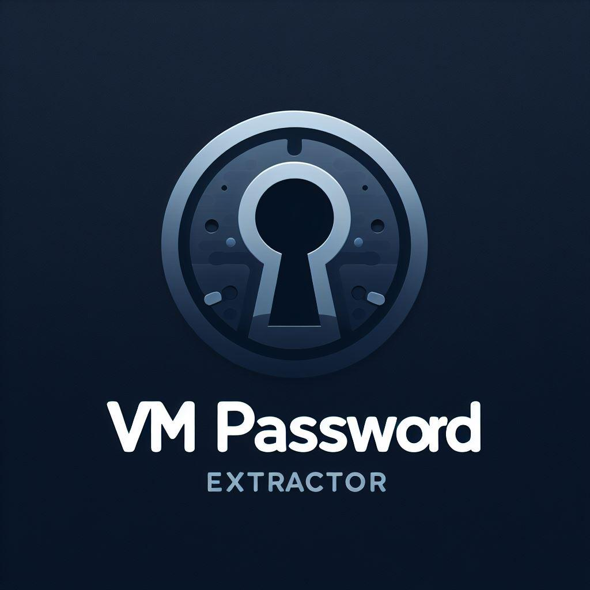

# Introduction 

The aim of this tool is to Extracting encryption metadata and credentials from encrypted Virtual Machines (VirtualBox and VMware) is the primary goal. This involves obtaining crucial encryption details such as symmetric encryption, hash algorithms, iterations, hash rounds, and salts. VM-Password-Extractor effectively organizes this data in a structured format aligned with the specifications used by hashcat and John the Rippe. (to leverage the power of these well-established tools and increase the chances of finding the right password quickly.)

This project stems from various mini-projects scattered across the web. Its aim is to amalgamate these initiatives into a centralized tool that consolidates prior discoveries. This eliminates the need to scour the depths of the web in search of scripts. Below are the projects/resources that aided in crafting this tool.

## Credits 

### Vbox Side : 
- Original Idea from @sinfocol
  - https://github.com/sinfocol/vboxdie-cracker
- First Python implementation : @axcheron
  - For more information about the KeyStore structure : https://github.com/axcheron/pyvboxdie-cracker/

### VMware Side : 

- Original Idea from @RF3
  - https://github.com/RF3/VMwareVMX
- Second Python implementation by : @axcheron
  - https://github.com/axcheron/pyvmx-cracker  

### Hashcat  : 
- VMware : https://github.com/hashcat/hashcat/pull/2882
- VirtualBox : https://github.com/hashcat/hashcat/pull/2884

List of hashcat supported hash : https://hashcat.net/wiki/doku.php?id=example_hashes

### John the ripper 
- VMware : https://github.com/openwall/john/issues/1849
- VirtualBox : https://github.com/openwall/john/pull/3633

List of johntheripper supported hash : (No official doc about it...)

*⬆️ For more information about the key store structure (VirtualBox and VMware), RTFM the two repo of axcheron ⬆️*

## Test environment for this project 
- python3.8 and python3.10 
- VMware Workstation 17.0.0
- VirtualBox 6.1 

# Getting Started 

## Clone and run
> the project **use only python3 built-in dependencies.**
```
git clone git@github.com:archidote/vm-passwords-hunter.git
cd vm-password-hunter/
python3 main.py
```

```
usage: main.py [-h] [--vbox VBOX] [--vmx VMX] [--vmx-password-hash-to-hashcat] [--vmx-password-hash-to-john] [--vbox-password-hash-to-hashcat] [--vbox-password-hash-to-john] [-o OUTPUT]
               [-v]

The aim of this tool is to Extracting encryption metadata and credentials from encrypted Virtual Machines (VirtualBox and VMware) is the primary goal. This involves obtaining crucial
encryption details such as symmetric encryption, hash algorithms, iterations, hash rounds, and salts. VM-Password-Extractor effectively organizes this data in a structured format aligned
with the specifications used by hashcat and John the Ripper

options:
  -h, --help            Help menu
  --vbox VBOX           Virtualbox VM configuration file. (.vbox extension)
  --vmx VMX             VMware VM configuration file. (.vmx extension)
  --vmx-password-hash-to-hashcat
                        Use the power of hashcat to try to break the password hash.
  --vmx-password-hash-to-john
                        Use the power of john to try to break the password hash.
  --vbox-password-hash-to-hashcat
                        Use the power of hashcat to try to break the password hash.
  --vbox-password-hash-to-john
                        Use the power of john to try to break the password hash. (!!! less efficient than hashcat !!!)
  -o OUTPUT, --output OUTPUT
                        Output the hash in a hash.txt file.
  -v, --verbose         Verbose mode.

```

# Examples 

## Extracting 

### VMware 

- Mode of encryption : PBKDF2-HMAC-SHA1 + AES-256-CBC : 
  - For hashcat : <code>python3 main.py --vmx assets/vmware/encrypted-vmx-file-example-PBKDF2-HMAC-SHA1-and-AES-256-CBC.vmx --vmx-password-hash-to-hashcat</code>
  - For john : <code>python3 main.py --vmx assets/vmware/encrypted-vmx-file-example-PBKDF2-HMAC-SHA1-and-AES-256-CBC.vmx --vmx-password-hash-to-john</code>

### Virtualbox 

- Mode of encryption PBKDF2-HMAC-SHA256 + AES-256-XTS
  - For hashcat : <code>python3 main.py --vbox assets/virtualbox/encrypted-vbox-file-example-PBKDF2-HMAC-SHA256-and-AES-256-XTS.vbox --vbox-password-hash-to-hashcat</code>
  - For john : <code>python3 main.py --vbox assets/virtualbox/encrypted-vbox-file-example-PBKDF2-HMAC-SHA256-and-AES-256-XTS.vbox --vbox-password-hash-to-john</code>
- Mode of encryption PBKDF2-HMAC-SHA256 + AES-128-XTS
  - For hashcat <code>python3 main.py --vbox assets/virtualbox/encrypted-vbox-file-example-PBKDF2-HMAC-SHA256-and-AES-128-XTS.vbox --vbox-password-hash-to-hashcat</code>
  - for john : <code>python3 main.py --vbox assets/virtualbox/encrypted-vbox-file-example-PBKDF2-HMAC-SHA256-and-AES-128-XTS.vbox --vbox-password-hash-to-john</code>

## Cracking 

### VMware 

- Mode of encryption : PBKDF2-HMAC-SHA1 + AES-256-CBC
  - Hashcat : Few seconds <code>hashcat -m 27400 -a 0 hash.txt /usr/share/wordlists/rockyou.txt</code>
  - John the ripper  : Few seconds <code>john --format=vmx --wordlist=/usr/share/wordlists/rockyou.txt hash.txt</code>

### VirtualBox 

- Mode of encryption PBKDF2-HMAC-SHA256 + AES-256-XTS
  - Hashcat : Few seconds/minutes : <code>hashcat -m 27600 -a 0 hash.20231127-110321.txt /usr/share/wordlists/rockyou.txt</code>
  - John the ripper  : Very Long <code>john --wordlist=/usr/share/wordlists/rockyou.txt hash.txt</code>
- Mode of encryption PBKDF2-HMAC-SHA256 + AES-128-XTS
  - Hashcat : Few seconds/minutes <code>hashcat -m 27500 -a 0 hash.txt /usr/share/wordlists/rockyou.txt</code>
  - John the ripper : Very Long <code>john --wordlist=/usr/share/wordlists/rockyou.txt hash.txt</code>